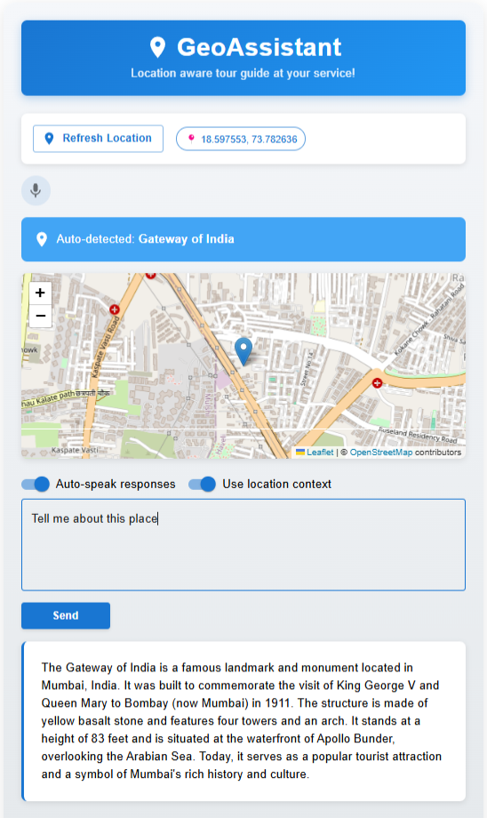

# 🌍🎙️ GeoAssistant: Location-Aware Voice-Enabled Tourist Assistant

**GeoAssistant** is a Progressive Web App (PWA) designed to function as a **location-aware, voice-enabled assistant** for tourist spots. It detects the user's **GPS location**, identifies nearby landmarks, and responds with **voice-guided information** using a **Zephyr-7B Alpha-powered chatbot** hosted via FastAPI.

---

## 📝 Project Overview

GeoAssistant is a proof-of-concept **smart assistant** that can:

- Automatically detect when a user is near a tourist destination
- Provide spoken prompts and suggestions
- Accept **voice or text queries**
- Return **context-aware responses** using a powerful language model
- Function as a **PWA**, accessible via any modern mobile browser

🔍 **Note:** This repository contains **only the essential files** to demonstrate the core functionality. Supporting assets, helper scripts, and extended configurations will not be uploaded to GitHub.

---

## 📸 Screenshot of the Web App

Here’s a screenshot of the **Location-Aware Voice-Enabled Assistant** web app in action:

> **Note:** The coordinates for Gateway of India in the image are not the real ones. To ensure the **GeoAssistant** works correctly, I saved my **live coordinates** as "Gateway of India" in the `locations.json` file (since my house is not a tourist spot). This way, when it fetched my real-time location, it displayed "Gateway of India" with the corresponding description. You can add any other location instead of Gateway of India for testing or deployment purposes. 🗺️📍

---

## 📂 File Descriptions

### ### 🔧 Backend Files

#### `backend/server.py`
A **FastAPI server** that:
- Receives user queries (optionally with GPS location)
- Passes the prompt to the **Zephyr-7B Alpha** language model
- Returns the generated response to the client
- Powers the chatbot logic behind the voice assistant

#### `backend/requirements_backend.txt`
Lists essential **Python dependencies** for the backend:
- FastAPI for API handling
- PyTorch (GPU-supported) for Zephyr model
- Speech Recognition and Text-to-Speech libraries
- Ensures smooth functioning of the voice-enabled backend

---

### 🌍 Frontend Files

#### `frontend/locations.json`
A **JSON database of landmarks**:
- Defines coordinates and radii for tourist spots
- Used to trigger the chatbot or voice guide when user is nearby

#### `frontend/gps.js`
Fetches the **user’s current GPS location**:
- Uses the browser’s built-in geolocation API
- Integrates with location trigger logic

#### `frontend/geo_trigger.js`
Performs **proximity detection**:
- Compares user GPS location to `locations.json`
- Uses **Haversine formula** to calculate distance
- Triggers chatbot/audio if user is within specified radius

#### `frontend/App.jsx`
The **core React frontend** of the PWA:
- Detects and tracks user’s location
- Checks for proximity to landmarks
- Enables **voice or text queries**
- Speaks model responses using **Text-to-Speech**
- Shows the user on an **interactive Leaflet map**
- Allows toggling of location & voice features

---

### 📦 Project-wide Requirements

#### `requirements_all.txt`
A comprehensive package list for the full stack:
- Frontend: React + location/voice support
- Backend: FastAPI, PyTorch, Transformers
- Optional ML tools: Jupyter, TensorFlow/Keras, etc.
- Ensures compatibility across all modules

---

## 🚀 Features at a Glance

- 📍 **Live GPS tracking** to detect nearby tourist spots
- 🔄 **Location triggers** for auto-activation of the assistant
- 🗣️ **Voice input/output** for a hands-free experience
- 💬 **Chatbot integration** using Zephyr-7B Alpha
- 🌐 **Works as a PWA**, installable on any smartphone
- 🗺️ **Map view** using Leaflet to visualize user position

---
